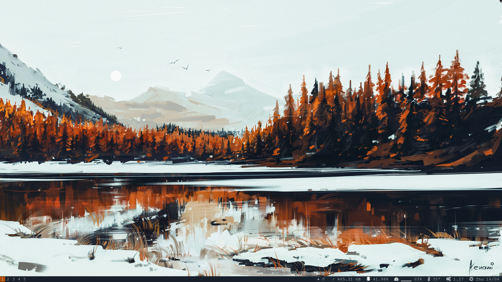
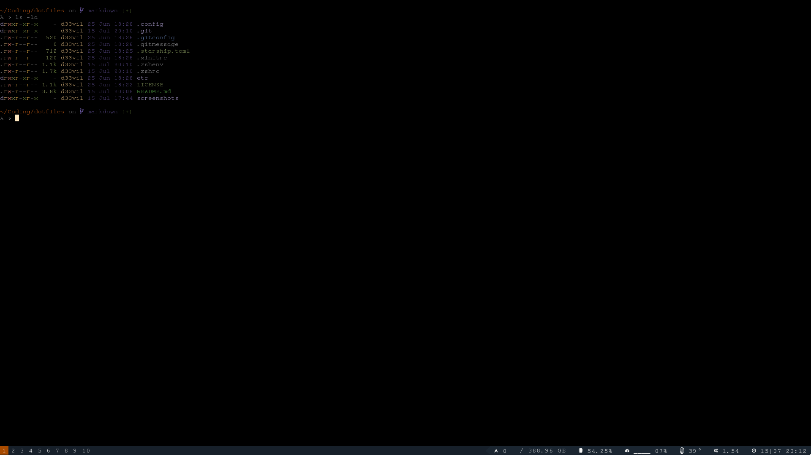
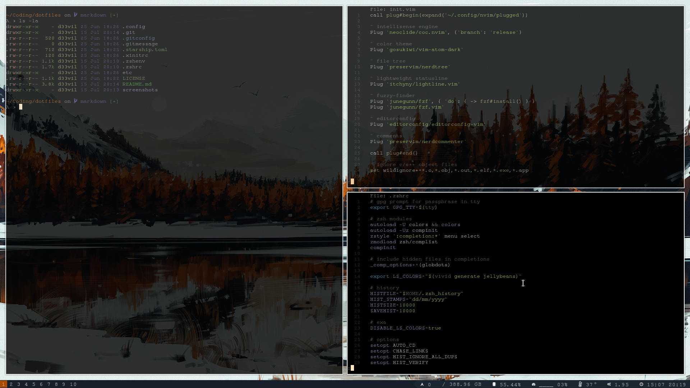
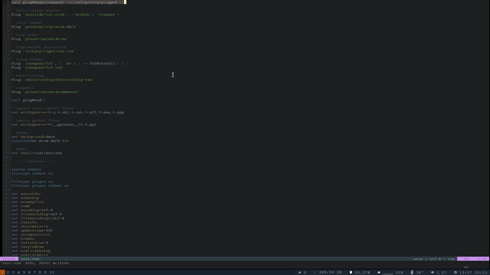
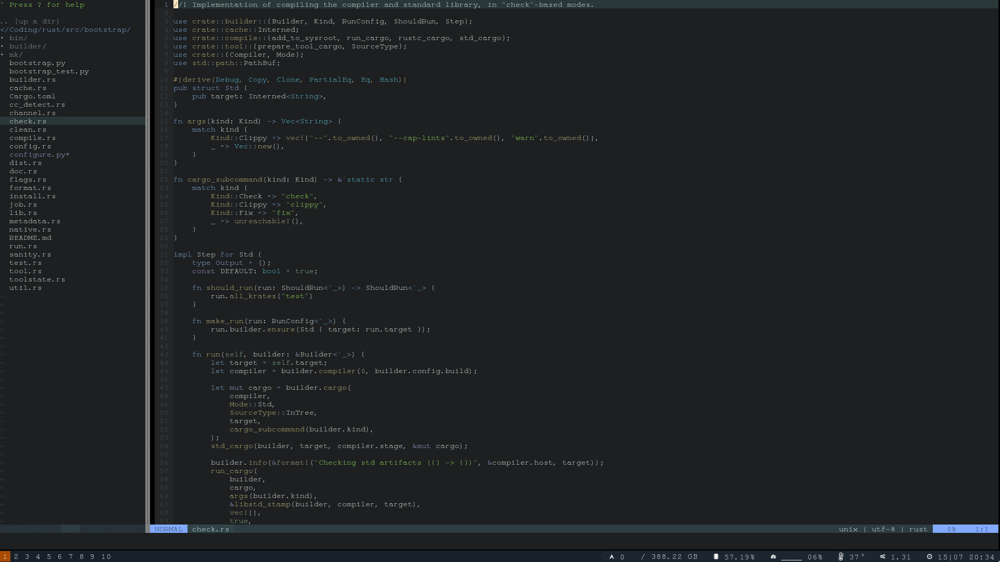
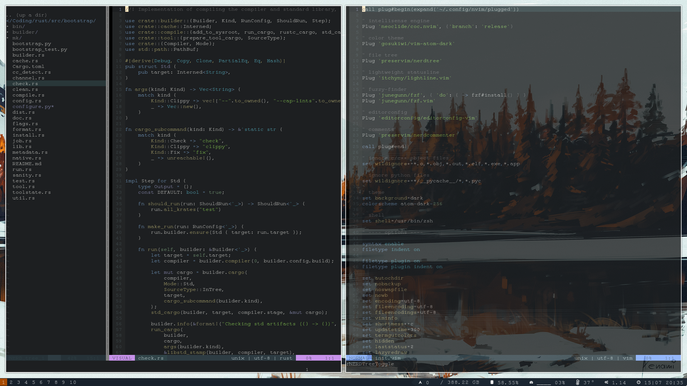

<div align="center">

# scuzie's ~/.dotfiles

</div>



<div align="center">

***"I use arch btw"***


</div>

## Preview

<details>
    <summary><a href="https://github.com/alacritty/alacritty">Alacritty</a> and <a href="https://github.com/zsh-users/zsh">Zsh</a> including <a href="https://github.com/ohmyzsh/ohmyzsh">oh-my-zsh</a> & <a href="https://github.com/starship/starship">starship</a></summary>
    <p></p>
</details>

<details>
    <summary><a href="https://github.com/Airblader/i3">i3-gaps</a> window manager and <a href="https://github.com/greshake/i3status-rust">i3status-rust</a> bar</summary>
    <p></p>
</details>

<details>
    <summary><a href="https://github.com/neovim/neovim">Neovim</a> using <a href="https://github.com/neoclide/coc.nvim">coc.nvim</a></summary>
    <p></p>
    <p></p>
    <p></p>
</details>

<details>
    <summary><a href="https://github.com/davatorium/rofi">Rofi</a> application launcher</summary>
    <p></p>
</details>

## Beyond

#### Shell related

~ | description
--|------------
[exa](https://github.com/ogham/exa) | a modern version of ls
[vivid](https://github.com/sharkdp/vivid) | LS_COLORS generator
[bat](https://github.com/sharkdp/bat) | cat(1) clone with wings
[fzf](https://github.com/junegunn/fzf) | a command-line fuzzy finder

#### WM related

~ | description
--|------------
[lightdm](https://github.com/canonical/lightdm) | cross-desktop display manager
[picom](https://github.com/yshui/picom) | lightweight compositor for X11
[playerctl](https://github.com/altdesktop/playerctl) | mpris command-line controller
[dunst](https://github.com/dunst-project/dunst) | customizable notifcation daemon
[feh](https://github.com/derf/feh) | a fast and lightweight image viewer

## Installation

As dotfiles are something very personal, this repository does not provide an install script.
Clone this repository and cherry-pick the parts you like.

#### Filesystem

In case you want to use my dotfiles, remember that the given repository structure is **NOT** identical 
to your local directory tree. In case you are wondering; this is how it *could* look like.

```bash
/
├── etc
│   └── lightdm
│       ├── lightdm.conf
│       └── lightdm-mini-greeter.conf
└── home
    └── $HOME
        ├── $PICTURES
        │   ├── samurai.png
        │   └── serenity.png
        ├── .config
        │   ├── alacritty
        │   │   └── alacritty.yml
        │   ├── bat
        │   │   └── config
        │   ├── dunstrc
        │   ├── i3
        │   │   ├── config
        │   │   ├── status.toml
        │   │   └── power.sh
        │   ├── nvim
        │   │   ├── coc-settings.json
        │   │   └── init.vim
        │   ├── picom.conf
        │   ├── rofi
        │   │   ├── config
        │   │   └── onedark.rasi
        │   └── starship.toml
        ├── .gitconfig
        ├── .gitmessage
        ├── .xinitrc
        ├── .zshenv
        └── .zshrc
```

## Credits

Working on my dotfiles took me many hours and really challenged my lack of creativy, so 
I wanted mention [@vbe0201](https://github.com/vbe0201/dotfiles), [@Stupremee](https://github.com/Stupremee/dotfiles) &
[@da-edra](https://github.com/da-edra/dotfiles), who did great work with their dotfiles and inspired me with mine. 
